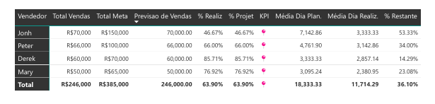

# PERFORMANCE-DE-VENDAS

# 📈 Performance de Vendas: Planejado vs. Realizado
💡 Pitch: Monitoramento estratégico de metas comerciais através de indicadores dinâmicos de faturamento, métricas de atingimento (Gap Analysis) e performance por categoria.

# 📌 Visão Geral
Este dashboard foi desenvolvido para o controle rigoroso de metas comerciais na organização fictícia ABC Corp. Diferente de um relatório de vendas comum, este projeto foca no Planejamento Estratégico, respondendo a perguntas críticas: "Quanto pretendíamos vender?" versus "Quanto realmente vendemos?", identificando desvios por categoria e região.

Objetivo: Analisar o atingimento de metas e identificar oportunidades de melhoria comercial.

Público-alvo: Diretores Comerciais, Gerentes de Vendas e Analistas de Planejamento (FP&A).

Fonte de Dados: Base estruturada do curso "Business Intelligence Completo" (Prof. André Rosa - Udemy), simulando um cenário real de controle de metas.
# IMAGEM  DO DESHBOARD 
  
  
 
# 🛠️ Tecnologias e Ferramentas
Power BI: Desenvolvimento de visualizações dinâmicas e dashboards.

Linguagem DAX: Cálculos complexos de variação percentual (Atingimento) e médias dinâmicas.

Power Query (ETL): Integração de duas fontes de dados distintas (Vendas Reais vs. Planejamento/Metas).

# 📊 Indicadores Chave (KPIs)
O painel foca em quatro pilares de gestão comercial:

Objetivo de Venda: Meta bruta estabelecida pela organização.

Média Planejada vs. Realizada: Comparativo de eficiência por transação.

Desempenho vs. Meta: Indicador percentual de atingimento (Gap Analysis).

# 💡 Insights e Recursos Visuais
📈 Diferenciais Analíticos
Análise de Velocímetros: Uso de Gauge Charts para visualização imediata do status da meta global.

Gráficos de Comparação: Barras com linhas de meta que permitem identificar quais categorias de produtos estão abaixo ou acima do planejado.

Auditoria Granular: Tabela de performance que cruza planejado e realizado lado a lado para facilitar a identificação de gargalos.
Conclusões Estratégicas extraídas:
Identificação de Gaps de Performance: Através da comparação entre a Média Planejada e a Média Realizada, é possível identificar se a força de vendas está conseguindo manter o ticket médio esperado ou se está concedendo descontos excessivos para atingir o volume, o que impacta diretamente a margem de lucro.

Análise de Pareto em Categorias: O dashboard revela quais categorias de produtos são "âncoras" (metas batidas com facilidade) e quais são "críticas" (abaixo do planejado). Isso permite ao gestor realocar investimentos de marketing ou treinar a equipe de vendas em produtos específicos.

Previsibilidade e Tendência: O uso de Velocímetros (Gauge Charts) fornece um feedback imediato sobre a velocidade das vendas. Se na metade do mês o atingimento está abaixo de 50%, o dashboard sinaliza a necessidade de uma ação promocional imediata antes do fechamento do período.

Equidade de Metas: Ao cruzar o Objetivo de Venda com diferentes regiões ou vendedores, o projeto permite auditar se as metas foram bem distribuídas (metas realistas) ou se existem desvios geográficos que exigem uma revisão no planejamento estratégico do próximo ciclo. 

# ⚙️ Inteligência de Dados
Modelagem Star Schema: Integração de tabelas Fato (Vendas e Metas) com dimensões comuns (Produtos e Calendário).

DAX Avançado: Medidas criadas para calcular a variação percentual entre o Realizado e o Planejado de forma dinâmica conforme os filtros.

# 💾 Origem e Fonte dos Dados
Projeto desenvolvido com base no curso "Business Intelligence Completo do ETL ao Power BI" do professor André Rosa (Udemy). A base é fictícia, mas estruturada para simular um cenário real de controle de metas corporativas. 

# ✍️ Autor
Marcos Inada

Analista de Dados | Power BI | Insights de Mercado

LinkedIn: [Seu Link Aqui]

E-mail: marcoscorleone1985@gmail.com  
